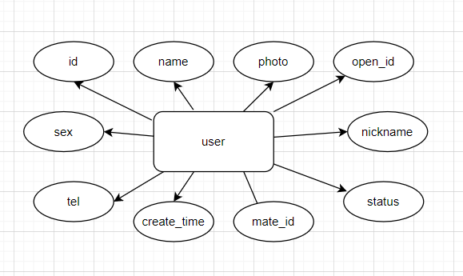
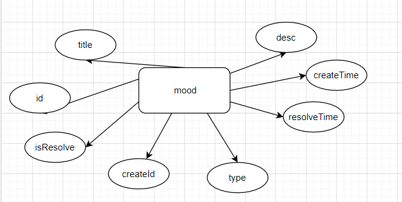
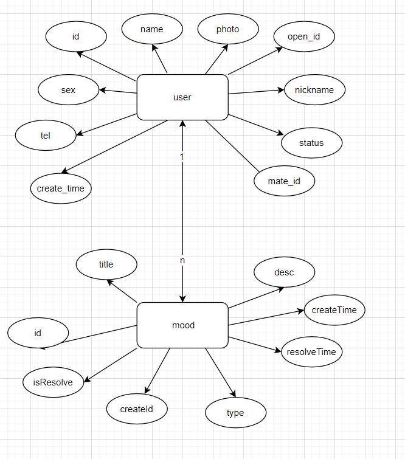

#
数据库设计

### ER图

### 关系模型
user(id, mate_id, open_id, name, sex, photo, tel, nickname, status, createTime);
mood(id, create_id, type, title, desc, photo, isResolve, resolve_time, create_time);

### 表创建

-- auto-generated definition
create table user
(
id          int auto_increment,
mate_id     int                                null comment '伴侣id',
open_id     varchar(200)                       null comment '微信小程序openId',
name        varchar(20)                        null comment '微信名',
sex         enum ('男', '女')                    null comment '性别',
photo       varchar(200)                       null comment '头像',
tel         char(11)                           null comment '电话',
nickname    varchar(200)                       null comment '昵称',
status      int                                null comment '状态（是否注销）',
create_time datetime default CURRENT_TIMESTAMP null,
constraint user_id_uindex
unique (id)
)
comment '用户表';

alter table user
add primary key (id);

-- auto-generated definition
create table mood
(
id           int auto_increment,
create_id    int                                not null comment '创建者Id',
type         int                                null comment '类型1:好心情 2 坏心情',
title        varchar(50)                        null comment '标题',
`desc`       varchar(1024)                      null comment '心情描述',
photo        json                               null comment '图片描述',
isResolve    tinyint(1)                         null comment '是否解决',
resolve_time datetime                           null comment '心情解决时间',
create_time  datetime default CURRENT_TIMESTAMP null comment '创建时间',
constraint mood_id_uindex
unique (id)
)
comment '心情';

alter table mood
add primary key (id);